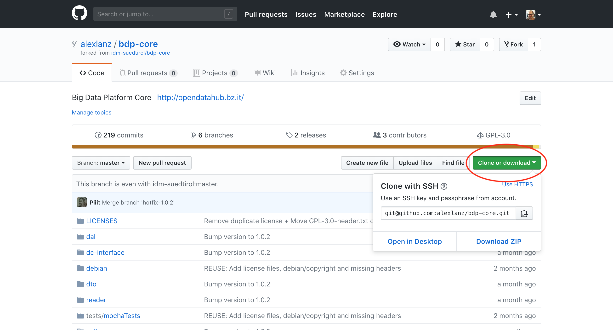

Documentation for Contributors
==============================

- [Prerequisites](#prerequisites)
- [Project Checkout](#project-checkout)
- [Create a Pull Request](#create-a-pull-request)
- [Syncing a Fork](#syncing-a-fork)
- [Resolving Merge Conflicts](#resolving-merge-conflicts)
- [Combine Two Separate Unrelated Git Repositories](#combine-two-Separate-Unrelated-Git-Repositories)

## Prerequisites

In the following documentation some example names are used. Please replace them with your names:

- Replace **your-username** with your username on GitHub.
- Replace **feature-branch** with your branch name.

## Project Checkout

1. Navigate to the repository on GitHub (ex: [https://github.com/noi-techpark/bdp-core](https://github.com/noi-techpark/bdp-core))

2. Create a fork of the repository by clicking the button **Fork** (and selecting the user where the fork should be created)
    

3. Navigate to your forked repository on GitHub (ex: [https://github.com/your-username/bdp-core](https://github.com/your-username/bdp-core))

4. Checkout your forked repository on your machine (ex: `git clone git@github.com:your-username/bdp-core.git`)
    

## Create a Pull Request

1. Checkout the **development** branch:
    ```bash
    git checkout development
    ```

2. Create a new branch from the **development** branch locally on your machine:
    ```bash
    git checkout -b feature-branch
    ```

3. Make some initial changes to the repository and commit them:
    ```bash
    git add -A
    git commit -m "Some commit message"
    ```

4. Push the new branch to GitHub:
    ```bash
    git push --set-upstream origin feature-branch
    ```

5. Navigate to [https://github.com/your-username/bdp-core/pull/new/feature-branch](https://github.com/your-username/bdp-core/pull/new/feature-branch) to create a new pull request
    

6. Commit and push any changes of the pull request to this new branch

7. For every commit the continuous integration pipeline will execute the tests and display the results in the pull request.
    

8. In addition, the detailed logs can be viewed under [https://ci.opendatahub.bz.it](https://ci.opendatahub.bz.it)

## Syncing a Fork

The fork repository does not receive the updates of the original repository automatically. To sync for example the **development** branch of the two repositories and to keep the forked repository up-to-date with all the latest changes of the **development** branch from the original repository, the following steps have to be performed.

Before you can sync your fork with the original repository (an upstream repository), you must configure a remote that points to the upstream repository in Git. A more detailed description for the following steps can be found [here](https://help.github.com/articles/configuring-a-remote-for-a-fork/).

1. List the current configured remote repository for your fork.
    ```bash
    git remote -v
    ```

2. Specify a new remote upstream repository that will be synced with the fork.
    ```bash
    git remote add upstream https://github.com/noi-techpark/bdp-core.git
    ```

3. Verify the new upstream repository you've specified for your fork.
    ```bash
    git remote -v
    ```

Sync a fork of a repository to keep it up-to-date with the original repository (upstream repository). A more detailed description for the following steps can be found [here](https://help.github.com/articles/syncing-a-fork/).

1. Fetch the branches and their respective commits from the upstream repository. Commits to **development** will be stored in a local branch, **upstream/development**
    ```bash
    git fetch upstream
    ```

2. Check out your fork's local **development** branch.
    ```bash
    git checkout development
    ```

3. Merge the changes from **upstream/development** into your local **development** branch. This brings your fork's development branch into sync with the upstream repository, without losing your local changes.
    ```bash
    git merge upstream/development
    ```

## Resolving Merge Conflicts

When creating and working on a pull request, it could happen that the destination branch of the original repository will be changed. These changes could result in merge conflicts.


To resolve merge conflicts, the following steps must be performed.

1. [Sync your fork repsoitory](#syncing-a-fork) and make sure your local destination (development) branch is up to date with the original (upstream) repository branch.

2. Check out your feature branch.
    ```bash
    git checkout feature-branch
    ```

3. Merge the changes of the development branch to the feature branch.
    ```bash
    git merge development
    ```

    The command will output the files with merge conflicts:

    

4. Go the the listed files of the previous output and resolve all merge conflicts. The conflicts in the files begin with `<<<<<<<` and end with `>>>>>>>`. The `=======` will split the two versions:

    

    You can simply resolve a conflict by deleting one of the two versions of the code and by deleting the inserted helper lines beginning with `<<<<<<<`, `=======` and `>>>>>>>`. If none of the two versions is completely correct, than you can delete the conflict entirely and write the right code you want.

5. Add all resolved files to the index, commit the canges and push the changes to the server.
    ```bash
    git add -A
    git commit
    git push
    ```

6. After resolving the merge conflicts, the pull request can be accepted.

    

A more detailed description can be found [here](https://help.github.com/articles/resolving-a-merge-conflict-using-the-command-line/).

## Combine Two Separate Unrelated Git Repositories

Sometimes it can happen that a team already starts developing a project before it receives the official repository. Later, when then the NOI team creates a GitHub repository it is hard for them to combine the two separate repositories into one repository with a common history.

To do so, let's suppose that you already have your private repository of the project checked out locally on your machine and you start from there:

1. Go to GitHub and create a fork of the repository from the NOI team

2. Add the fork as upstream to your locally cloned version:

    ```bash
    git remote add upstream git@github.com:username/project.git
    ```

3. Pull the changes from the upstream repository to your local repository's master branch:

    ```bash
    git pull upstream master --allow-unrelated-histories
    ```

4. If there are some conflicts, fix them and commit the changes

    ```bash
    git add -A
    git commit -m "Merging the two repositories"
    ```

5. Push the changes two both repositories

    ```bash
    git push upstream master
    git push origin master
    ```

From now on the two repositories are in sync and you can continue working like normal.
